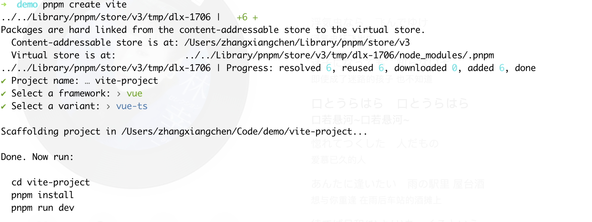
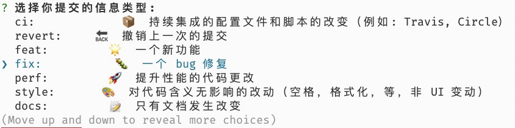

## 目录

- [项目初始化](#项目初始化)

- [使用 unplugin-vue-components 实现组件自动导入](#使用unplugin-vue-components实现组件自动导入)

- [使用 unplugin-auto-import 实现 API 自动导入](#使用unplugin-auto-import实现api自动导入)

- [使用 eslint 格式化代码](#使用eslint格式化代码)

  - [VSCode 自动格式化设置](#vscode自动格式化设置)
  - [在项目中提示 eslint 错误](#在项目中提示eslint错误)
  - [TypeScript 错误](#typescript错误)

- [git commit 代码格式校验和修复](#git-commit代码格式校验和修复)

  - [格式化指定环境变量](#格式化指定环境变量)

- [git commit 信息规范化](#git-commit信息规范化)

  - [使用 commitizen 生成标准的提交信息](#使用commitizen生成标准的提交信息)
  - [更友好的信息规范](#更友好的信息规范)
  - [生成 changelog](#生成changelog)

# 我的 vue3 项目基础配置

> 项目地址：[https://github.com/x007xyz/vite-vue3/tree/config](https://github.com/x007xyz/vite-vue3/tree/config "https://github.com/x007xyz/vite-vue3/tree/config")

这篇文章是我本人构建 vue3 项目的一些基础配置，项目使用了当前流行的 TypeScript，构建工具选择了最新 vite3.0，包管理工具使用 pnpm，组件库使用 element-plus；实现了：

1.  使用`unplugin-vue-components`实现组件自动导入

2.  使用`unplugin-auto-import`实现 API 自动导入

3.  使用 Eslint 格式化代码

4.  `git commit`代码格式校验和修复

5.  `git commit`信息规范化

感兴趣的小伙伴可以接下来和我一起聊一下具体配置：

### 项目初始化

使用 vite 构建 vue 项目无需多言，安装[官网文档](https://vitejs.dev/guide/#scaffolding-your-first-vite-project "官网文档")，执行命令：

```bash
pnpm create vite
```

然后填写自己喜欢的项目名称，然后框架选择 vue，模式使用 vue-ts 即可



### 使用 unplugin-vue-components 实现组件自动导入

`unplugin-vue-components`支持 Vite, Webpack, Vue CLI, Rollup, esbuild 等构建工具，并且对 TypeScript 支持友好，使用也十分简单，首先在你的项目中添加：

```bash
pnpm i unplugin-vue-components -D
```

然后在`vite.config.js`中添加如下配置:

```javascript
import Components from "unplugin-vue-components/vite";
import { ElementPlusResolver } from "unplugin-vue-components/resolvers";
export default defineConfig({
  plugins: [
    Components({
      dts: true, // 为了获得对自动导入组件的ts支持
      dirs: ["src/components"], // 用于搜索组件目录的相对路径
      types: [
        {
          from: "vue-router",
          names: ["RouterLink", "RouterView"],
        },
      ], // 全局注册的组件，插件无需导入，对ts不友好，所以需要手动注册它们的类型
      resolvers: [ElementPlusResolver()], // 导入组件库解析器
    }),
  ],
});
```

其中：

1.  dirs 指定搜索组件目录的相对路径，指定目录下的组件会在使用时，自动引入；

2.  types 处理全局注册的组件对 ts 不友好的问题，用来手动注册它们的类型；

3.  resolvers 用来导入组件库解析器，组件库解析器是对流行的 vue 组件库提供自动导入功能；

配置完成后，我们在项目中使用组件就能够提供自动导入功能，自动导入的组件可以在项目根目录下的`components.d.ts`文件中看到：

```typescript
declare module "@vue/runtime-core" {
  export interface GlobalComponents {
    ElButton: typeof import("element-plus/es")["ElButton"];
    HelloWorld: typeof import("./src/components/HelloWorld.vue")["default"];
    RouterLink: typeof import("vue-router")["RouterLink"];
    RouterView: typeof import("vue-router")["RouterView"];
  }
}
```

### 使用 unplugin-auto-import 实现 API 自动导入

`unplugin-auto-import`和`unplugin-vue-components`类似，它是实现 api 自动导入的，在 vue3 的组合式 api 写法时，我们经常需要引入如`ref`、`computed`之类的 vue 的全局 api，使用`unplugin-auto-import`我们就不再需要手动引入了。我们先来安装：

```bash
pnpm i unplugin-auto-import -D
```

然后在 vite.config.ts 中添加配置：

```javascript
import AutoImport from "unplugin-auto-import/vite";

// https://vitejs.dev/config/
export default defineConfig({
  plugins: [
    AutoImport({
      dts: true,
      imports: ["vue", "vue-router"],
      // 可以选择auto-import.d.ts生成的位置，使用ts建议设置为'src/auto-import.d.ts'
      // dts: 'src/auto-import.d.ts'
      eslintrc: {
        // 生成eslint的配置文件，需要在eslint配置中导入
        enabled: true, // Default `false`
        globalsPropValue: "readonly", // Default `true`, (true | false | 'readonly' | 'readable' | 'writable' | 'writeable')
      },
    }),
  ],
});
```

`unplugin-auto-import`会在项目中生成一个`auto-import.d.ts`文件，文件中就是我们自动导入的 api，imports 指定我们需要自动引入 api 的包，eslintrc 选项生成 eslint 的配置我们，接下来使用 eslint 实现代码格式化就会用到它了。

### 使用 eslint 格式化代码

初始化 eslint 文件，运行如下代码（需要全局安装 eslint）或者手动创建`.eslintrs.js`文件：

```bash
eslint init
```

> 建议全局安装，因为 vscode 的插件也依赖全局 eslint

创建好配置文件之后，我们安装 eslint 及相关依赖：

```bash
pnpm add eslint -D // eslint本体
pnpm add eslint-plugin-vue -D // vue官方配置
pnpm add prettier -D // 添加prettier
pnpm add eslint-plugin-prettier eslint-config-prettier -D// 添加eslint的prettier插件
pnpm add @typescript-eslint/eslint-plugin @typescript-eslint/parser -D// 增加对ts的支持

```

然后修改`.eslintrs.js`：

```javascript
module.exports = {
  root: true,
  env: {
    node: true,
    browser: true,
    es2021: true,
    "vue/setup-compiler-macros": true,
  },
  parser: "vue-eslint-parser",
  parserOptions: { ecmaVersion: 12, parser: "@typescript-eslint/parser" },
  extends: [
    "plugin:prettier/recommended",
    "eslint:recommended",
    "plugin:vue/vue3-recommended",
    "./.eslintrc-auto-import.json", // 导入自动导入api的配置文件
  ],
  plugins: ["prettier", "@typescript-eslint"],
  rules: {
    "prettier/prettier": ["error"],
    "vue/max-attributes-per-line": [
      "error",
      {
        singleline: {
          max: 4,
        },
        multiline: {
          max: 3,
        },
      },
    ],
    "vue/html-self-closing": [
      "error",
      {
        html: { normal: "never", void: "always" },
      },
    ],
    "no-console": process.env.NODE_ENV === "production" ? "error" : "warn",
    "no-debugger": process.env.NODE_ENV === "production" ? "error" : "warn",
    "no-unused-vars": [
      "error",
      { vars: "all", args: "none", ignoreRestSiblings: true },
    ],
    "vue/singleline-html-element-content-newline": "off",
    "vue/multi-word-component-names": "off",
  },
};
```

配置中除了引入的 eslint 相关依赖和我们刚才使用`unplugin-auto-import`生成的配置文件`eslintrc-auto-import.json`我还添加了一些自定义的规则，使用了**环境变量**区分不同环境的格式化规则配置。

#### VSCode 自动格式化设置

在 VSCode 保存时自动格式化文档，在 VSCode 配置中添加：

```json
"[vue]": {
  "editor.defaultFormatter": "Vue.volar"
},
```

如果使用了 Vetur 可能出现报错，建议在 Vue3 的项目中将 Vetur 禁用

#### 在项目中提示 eslint 错误

使用`vite-plugin-eslint`，首先在项目中安装：

```bash
pnpm add vite-plugin-eslint -D
```

然后在`vite.config.ts`中添加配置：

```bash
import eslintPlugin from 'vite-plugin-eslint'

export default defineConfig({
  plugins: [
  vue(),
  eslintPlugin({
    exclude: ['./node_modules/**'],
    cache: false
  })
  ]
})
```

如果出现下面的错误：

```text
Cannot read config file: /Users/zhangxiangchen/Code/demo/vite-vue3/.eslintrc.js Error: require() of ES Module /Users/zhangxiangchen/Code/demo/vite-vue3/.eslintrc.js from /Users/zhangxiangchen/Code/demo/vite-vue3/node_modules/.pnpm/@eslint+eslintrc@1.3.0/node_modules/@eslint/eslintrc/dist/eslintrc.cjs not supported. .eslintrc.js is treated as an ES module file as it is a .js file whose nearest parent package.json contains "type": "module" which declares all .js files in that package scope as ES modules. Instead rename .eslintrc.js to end in .cjs, change the requiring code to use dynamic import() which is available in all CommonJS modules, or change "type": "module" to "type": "commonjs" in /Users/zhangxiangchen/Code/demo/vite-vue3/package.json to treat all .js files as CommonJS (using .mjs for all ES modules instead).
```

需要将.eslintrs.js 修改为.eslintrs.cjs

#### TypeScript 错误

需要在`tsconfig.json`中添加配置`"include": [".d.ts"]`

### git commit 代码格式校验和修复

在`git commit`提交代码时，我们希望对代码进行格式校验和自动修复，可以使用`husky`和`lint-staged`，还是先安装：

```javascript
pnpm install husky lint-staged -D
```

在`package.json > prepare`添加脚本：

```javascript
npm set-script prepare "husky install"
npm run prepare
```

然后使用`husky`添加一个 git 钩子：

```javascript
npx husky add .husky/pre-commit "npm test"
git add .husky/pre-commit
```

在`package.json`中添加`lint-staged`相关配置

```javascript
"scripts": {
    "lint": "lint-staged"
 },
"lint-staged": {
    "*.{js,ts,tsx,jsx,vue}": [
      "eslint --fix",
      "prettier --write",
      "git add"
    ],
    "{!(package)*.json,*.code-snippets,.!(browserslist)*rc}": [
      "prettier --write--parser json"
    ],
    "package.json": [
      "prettier --write"
    ],
    "*.md": [
      "prettier --write"
    ]
}
```

配置完成之后，我们执行`git commit`时就会对缓存文件进行校验和格式化。

#### 格式化指定环境变量

刚才我们配置 eslint 时，使用到环境变量，使得不同环境时使用不同的 eslint 配置，当我们执行 git commit 环境变量希望是`production`，但是我们现在是无法做到的。

如果是使用 vue-cli 的项目，我们可以根据环境变量对`eslintrc.js`设置不同的配置：

```javascript
vue-cli-service lint --mode production
```

而使用 eslint --fix 是无法设置环境变量的，我们只能通过使用 node 调用 eslint 执行格式化的方式，使环境变量生效，我们新增一个`script/lint.cjs`文件，通过 node 调用 eslint 的 node-api 来实现：

```javascript
const { ESLint } = require("eslint");

const files = process.argv.slice(1).map((val, index) => {
  return val;
}); // 获取缓存文件，lint-stage执行命令时会被缓存文件作为参数传递过来
(async function main() {
  // 1. Create an instance with the `fix` option.
  const eslint = new ESLint({ fix: true });

  // 2. Lint files. This doesn't modify target files.
  const results = await eslint.lintFiles(files);

  // 3. Modify the files with the fixed code.
  await ESLint.outputFixes(results);

  // 4. Format the results.
  const formatter = await eslint.loadFormatter("stylish");
  const resultText = formatter.format(results);

  // 5. Output it.
  // eslint-disable-next-line no-console
  // console.log(resultText);
  if (resultText) {
    throw new Error(resultText);
  }
})().catch((error) => {
  process.exitCode = 1;
  console.error(error.message);
});
```

因为 lint-stage 只支持命令，所以我们无法直接设置`NODE_ENV=production node ./script/lint.cjs`，需要先添加脚本 eslint :

```javascript
"scripts": {
    "eslint": "NODE_ENV=production node ./script/lint.cjs"
 },
```

然后再修改`lint —fix`为 `pnpm run eslint`即可。

### git commit 信息规范化

开发项目时，git 提交信息其实很重要，规范的提交信息能够很快的帮助我们找到问题和回溯代码，现在我们来对 git 提交信息也进行规范化。

在项目中添加：

```bash
pnpm add @commitlint/cli @commitlint/config-conventional -D
```

`@commitlint/cli`实现对提交信息的校验，拒绝不符合格式的提交信息，`@commitlint/config-conventional`是提交信息的格式规范。

新增`.commitlintrc.cjs`文件：

```javascript
module.exports = { extends: ["@commitlint/config-conventional"] };
```

使用 hosky 添加 git 钩子

```javascript
npx husky add .husky/commit-msg 'npx --no-install commitlint --edit "$1"'
```

使用 git commit -m '测试提交'提交信息，将会出现提示，不符合提交规范，标准的提交规范为：

```javascript
<type>[optional scope]: <description>

[optional body]

[optional footer(s)]
```

#### 使用 commitizen 生成标准的提交信息

手写符合规范的 commit 信息太麻烦了，我们可以使用 commitizen 来帮助我们生成提交信息:

```javascript
pnpm add commitizen -D

```

然后初始化 commitizen 配套的适配器

```javascript
npx commitizen init cz-conventional-changelog --save-dev --save-exact
```

如果出现错误，可以清除 npm 包的缓存然后重试（使用 rm -rf ./node_modules），在 package.json 中添加命令

```javascript
"scripts": {
    "commit": "cz"
 },
```

运用`pnpm run commit`然后安装提示就可以生成 commit 信息了。

我们也可以使用 husky，通过 git hook 实现 git commit 自动执行 cz，运行如下命令

```javascript
npx husky add .husky/prepare-commit-msg "exec < /dev/tty && node_modules/.bin/cz --hook || true"
```

#### 更友好的信息规范

现在我们的 commit 信息都是英文，我们使用`vue-cli-plugin-commitlint`替换原本的`cz-conventional-changelog`和`@commitlint/config-conventional`，修改`.commitlintrc.cjs`文件：

```javascript
module.exports = {
  extends: ["./node_modules/vue-cli-plugin-commitlint/lib/lint"],
};
```

修改 package.json 配置：

```javascript
"config": {
  "commitizen": {
    "path": "./node_modules/vue-cli-plugin-commitlint/lib/cz"
  }
}
```

运行 git commit 或者`pnpm run commit`就会出现中文的信息提示：



如果不愿意这么麻烦也可以对`conventional-changelog`进行自定义配置：

```javascript
"config": {
        "commitizen": {
            "path": "./node_modules/cz-conventional-changelog",
            "disableScopeLowerCase": false,
            "disableSubjectLowerCase": false,
            "maxHeaderWidth": 100,
            "maxLineWidth": 100,
            "defaultType": "",
            "defaultScope": "",
            "defaultSubject": "",
            "defaultBody": "",
            "defaultIssues": "",
            "types": {
              ...
              "feat": {
                "description": "A new feature",
                "title": "Features"
              },
              ...
            }
        }
    }
```

#### 生成 changelog

使用`conventional-changelog-cli`生成 changelog 文件：

```javascript
pnpm add conventional-changelog-cli -D
```

然后添加命令：

```javascript
"log": "conventional-changelog --config ./node_modules/vue-cli-plugin-commitlint/lib/log -i CHANGELOG.md -s -r 0"
```

需要生成 changelog 文件时，运行`pnpm run log`
